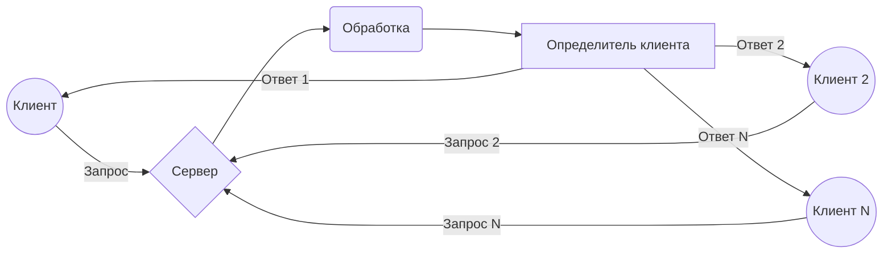
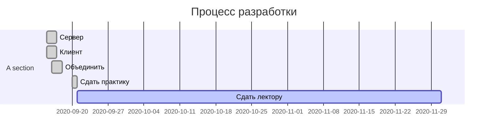
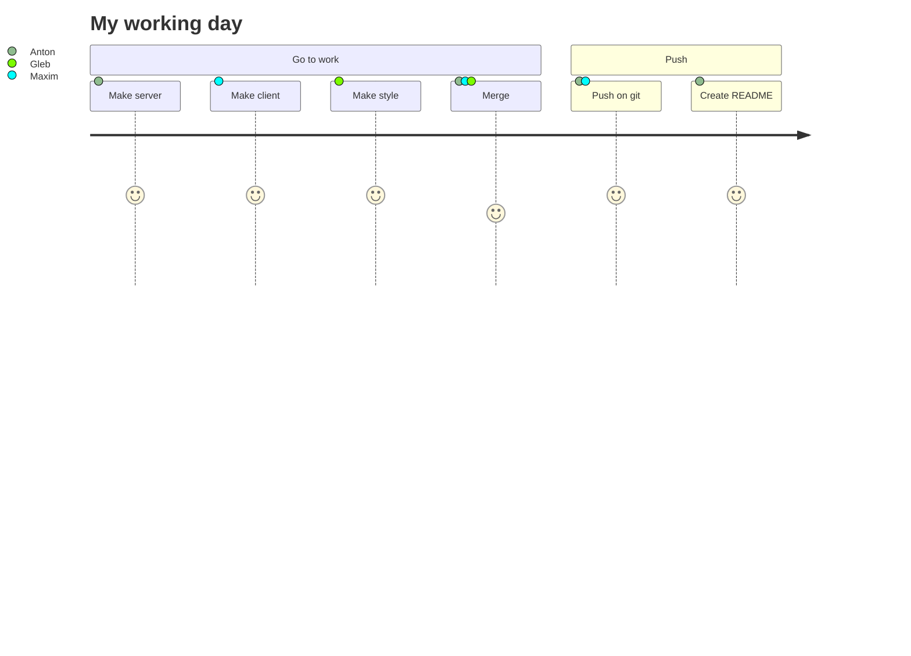
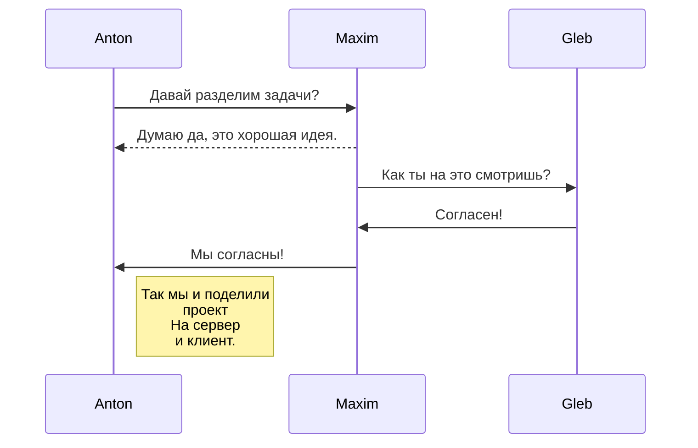

# TCP Network

**Chat TCP in development**
____
## О проекте:
чат сервер основа на tcp соединении , поддерживает отправку различных пакетов, на данном этапе разработки есть тестовый пакет и пакет с сообщениями. Сервер поддерживает может поддерживать до 100 человек одновременно , благодаря реализации много поточности внутри клиента и сервера.

Для более разборчивого понимания пользователи могут отличить себя от остальных , благодаря ключевой фразе another user

### Технологии:

TCP.

### Created by:

- **Anton Biluta [(antonbiluta)](https://github.com/antonbiluta)**

- **Maksim Bobrovskii [(Slimenion)](https://github.com/Slimenion)**

- **Gleb Bushelenkov**
##### Таблица работы:
|                |Обязанности               |Выполнено                         |
|----------------|--------------------------|-----------------------------|
|Anton			|`Сервер`        |'Готово'            |
|Maxim          |`Клиент`        |"Готово"            |
|Gleb          |`-- Страдать --- херней`|-- как всегда, --- безупречно|

____
> **Заметка:** Здесь **большинство** информации создано для эксперимента.
